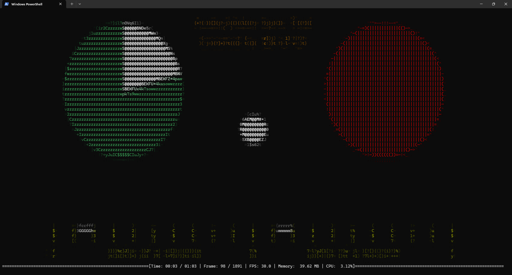
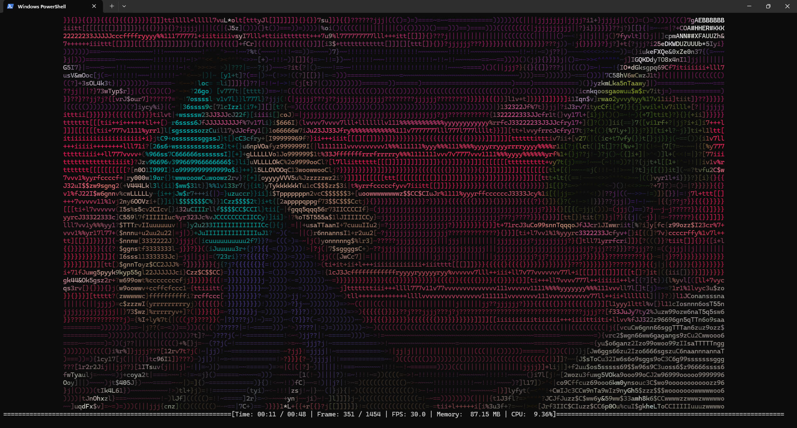
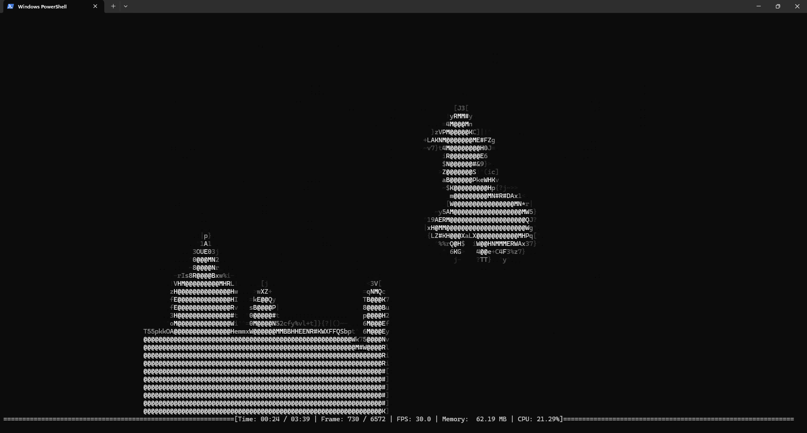

# ascii-rs

A Rust command line tool that plays videos as _coloured_ ASCII art directly in your terminal with minimal performance overhead.

## Screenshots

And everyone's favourite:

## Steps to run

-   If not already, install Rust [via rustup](https://rustup.rs) and FFmpeg (ffmpeg must be on your system PATH).
-   Put a video file somewhere on your machine (e.g., videos/sample.mp4).
-   From the project root, run in your terminal:
    -   Debug: `cargo run -- <path-to-video>`
    -   Release: `cargo run --release -- <path-to-video>`
-   Use Ctrl+C to stop playback at any time.

## Notes

-   Larger terminals look better; a minimum of `30 columns x 20 rows` is recommended.
-   Tested on Windows Terminal (Powershell): Achieved ~30fps with `305 columns x 109 rows` (from a 1080p/30fps video) running on a 3.6GHz CPU.
-   A cache file is created to speed up subsequent runs of the same video.
-   Add --regenerate to force rebuilding the ASCII cache for that video.

## Dependencies

Check  for a full list of dependencies.
