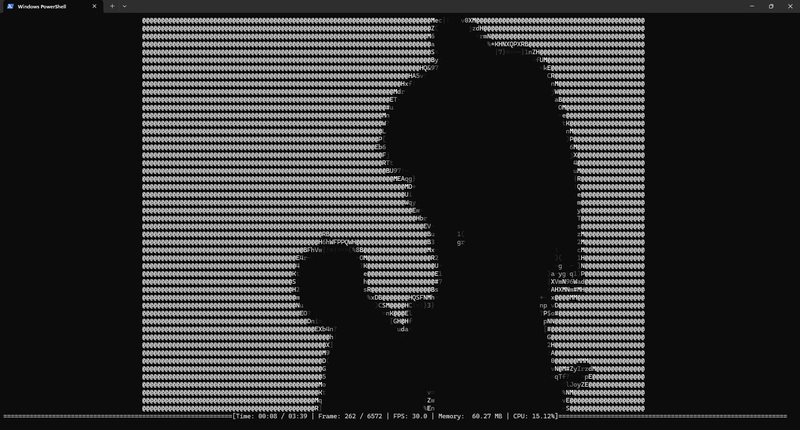

# ascii-rs

A Rust command line tool that plays videos as _coloured_ ASCII art directly in your terminal with minimal performance overhead.

## Screenshots


And everyone's favourite:



## Pre-requisites

-   CPU with decent performance
-   FFmpeg (must be on your system PATH)
-   A terminal emulator that supports Unicode and ANSI escape codes

## Usage

-   Grab the latest release from [releases](https://github.com/minhcrafters/ascii-rs/releases).
-   Run in your terminal:
    ```bash
    ./ascii-rs <path-to-video> # play the video

    ./ascii-rs <path-to-video> --regenerate # force rebuild the ASCII cache
    ```

## Manual Installation

-   If not already, install Rust [via rustup](https://rustup.rs) and FFmpeg (ffmpeg must be on your system PATH).
-   Clone this repository and navigate to the root directory.
-   From the project root, run in your terminal:
    -   Debug: `cargo run -- <path-to-video> # --regenerate`
    -   Release: `cargo run --release -- <path-to-video> # --regenerate`

## Notes

-   Larger terminals look better; a minimum of `30 columns x 20 rows` is recommended.
-   Tested on Windows Terminal (Powershell): Achieved ~30fps with `305 columns x 109 rows` (from a 1080p/30fps video) running on a 3.6GHz CPU.
-   A cache file is created to speed up subsequent runs of the same video.

## Dependencies

Check [Cargo.toml](./Cargo.toml) for a full list of dependencies.
